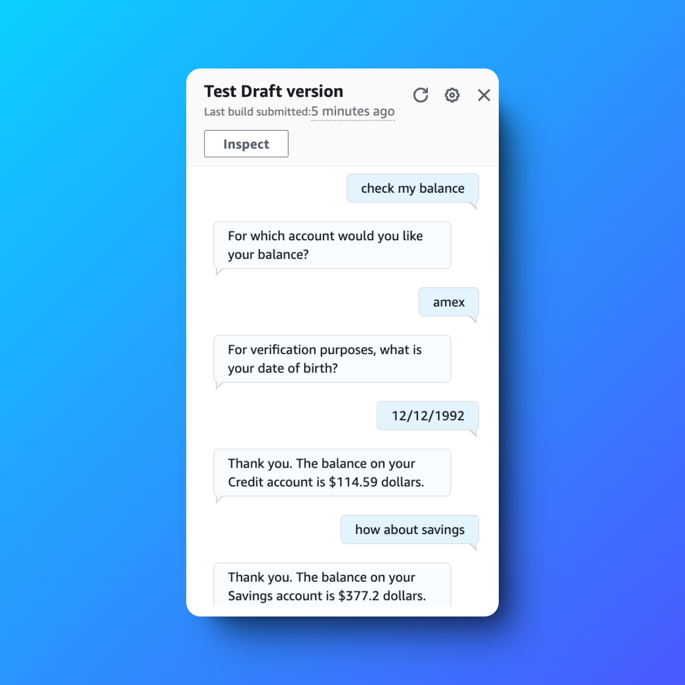
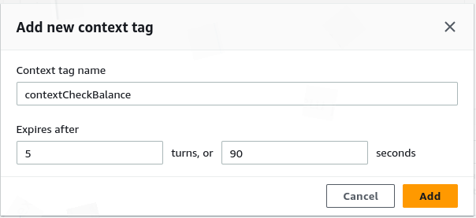
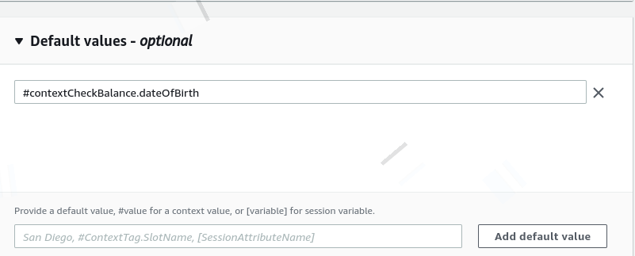
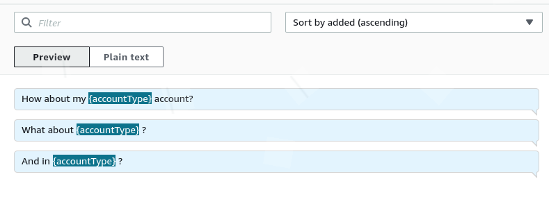

# Saving User Info with Amazon Lex Chatbot 🤖

---

## 📜 Table of Contents

1. [Project Overview](#project-overview)
2. [Features](#features)
3. [Key Deliverables](#key-deliverables)
4. [Challenges and Lessons Learned](#challenges-and-lessons-learned)
5. [Outcome](#outcome)
6. [Tools and Technologies Used](#tools-and-technologies-used)
7. [Steps to Reproduce](#steps-to-reproduce)
8. [Screenshots](#screenshots)
9. [Acknowledgments](#acknowledgments)
10. [Author](#author)

---

## Project Overview

This project leverages **Amazon Lex** to create a chatbot capable of saving and utilizing user information through **context tags**. By enabling context-aware conversations, the chatbot provides a seamless user experience by remembering details, such as the user's date of birth, for follow-up queries without requiring repetitive input.

---

## Features

- **Context Tags**: Manage and retain session-specific information for enhanced conversational flows.
- **Follow-Up Intents**: Enable the chatbot to handle additional queries without re-authentication.
- **Dynamic Interactions**: Provide personalized responses based on stored user data.

---

## Key Deliverables

1. **Context Management**:
   - Configured input and output context tags (`contextCheckBalance`) to retain user details across intents.

2. **Intent Creation**:
   - Designed `CheckBalance` and `FollowupCheckBalance` intents to manage user balance inquiries.

3. **Improved User Experience**:
   - Automated responses to follow-up queries by leveraging stored context.

---

## Challenges and Lessons Learned

### Challenges
- Configuring context tags to ensure smooth transitions between intents.
- Managing scenarios where the context tag is not set, leading to fallback behavior.

### Lessons Learned
- **Context Management**: Proper use of context tags significantly improves user interactions.
- **Error Handling**: A robust fallback mechanism ensures graceful handling of unrecognized inputs.

---

## Outcome

The chatbot successfully automates user interactions by leveraging context tags to save and utilize user details for follow-up queries, enhancing efficiency and engagement.

---

## Tools and Technologies Used

- **Amazon Lex**: For building and managing the conversational interface.
- **AWS Lambda**: To extend functionality and process dynamic responses (optional).
- **AWS Management Console**: For testing and configuration.
- **Context Tags**: To retain and utilize session-specific user data.

---

## Steps to Reproduce

1. **Set Up Amazon Lex**:
   - Create a new bot and configure intents (`CheckBalance` and `FollowupCheckBalance`).
   - Add training phrases for each intent.

2. **Configure Context Tags**:
   - Define `contextCheckBalance` as an output context tag in `CheckBalance`.
   - Set the same tag as an input context in `FollowupCheckBalance`.

3. **Test the Chatbot**:
   - Interact with the bot to check balance.
   - Request additional details to trigger the follow-up intent.

4. **Handle Fallbacks**:
   - Ensure fallback behavior is defined for unrecognized queries.

---

## Screenshots

### Context Tag Configuration  

### Default Values  

### Intent Utterances

---

## Acknowledgments

Special thanks to **NextWork.org** for providing project guidelines and the community support that guided the implementation of this chatbot.

---

## Author

**Hassan Gachoka**  
  

